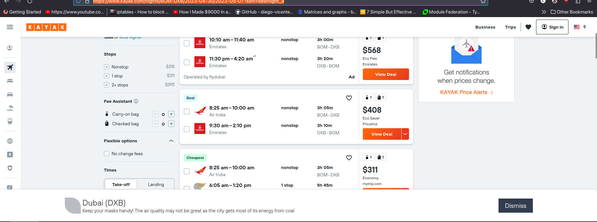
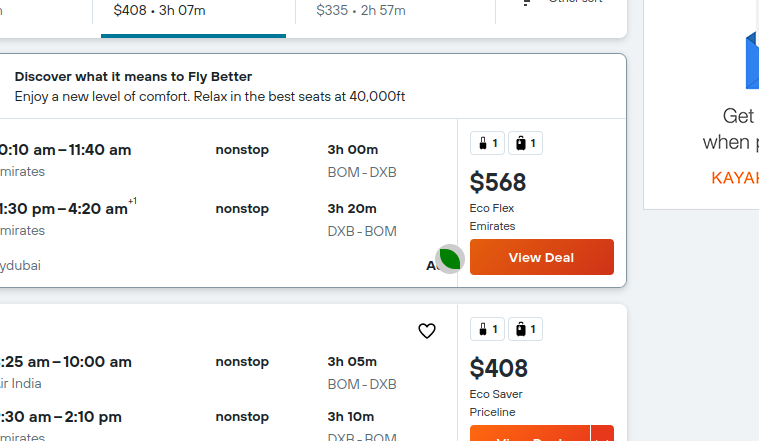

# eco.mio Browser Extension

#### Table of Contents

- [Description](#description)
- [Prerequisites](#prerequisites)
- [Installation](#installation)
- [Usage](#usage)
- [Building & Deployment](#building--deployment)
- [Publish to the Chrome Web Store](#publish-to-the-chrome-web-store)
- [Project Structure](#project-structure)
- [Commands](#commands)
- [Tools](#tools)

---

## Prerequisites

1. Installed Chrome or Edge Browser
2. NodeJS from https://nodejs.org/en/download/ (for npm)

---

## Installation

* Make sure you're running https://github.com/YogirajT/ecomio-be locally for this extension to save and retrive data.

1. Create your own repository from the template and clone into it

2. Install the node modules: `npm install`

3. Build the extension in hot-reloading mode with `npm run watch`

4. Install the Quick Extension Reload Extension for easy reloading in development :https://chrome.google.com/webstore/detail/quick-extension-reload/goeiakeofnlpkioeadcbocfifmgkidpb.

5. Enable extension in the browser:
   1. Type chrome://extensions into the search bar on Chrome (edge://extensions for Edge).
   2. Enable "Developer mode" with top right switch (bottom left on Edge).
   3. Click "Load unpacked" and select the `extension-challenge/dist/` folder.

---

## Usage

1. To continuosly rebuild after code and file changes were saved we execute the following npm script: `npm run watch`

2. Before testing/debugging in the browser we need to refresh the extension in our browser: Press **"Alt" + "R"** when in the browser. (Requires the Quick Extension Reload Extension, see "Installation".)

Note: To apply changes in the code to the extension one could also manually do so by hitting the refresh arrow of the extension at chrome://extensions/.

---

## Project Structure

The overall project is structured as follows:

      extension-challenge
      ├── dist*
      ├── public
      ├── src
      └── webpack

_\*not checked in_

- **dist:**
  - the build files (once created)
- **public:**
  - all static files for the extension in general, like css and images
- **src:**
  - contains all the source code
- **webpack:**
  - webpack configuration files for development

\
The src folder of the project is structured as follows:

    src
    ├── assets
    ├── tests
    ├── types
    |
    └── main.ts

The subfolders serve the following purpose:

- **assets:**
  - folder containing the project's style files, fonts and images
- **tests:**
  - tests (including end-to-end tests) for the project. Initially empty
- **types:**
  - custom types and interfaces.

And the file:

- **main.ts:**
  - where the magic happens. Main script that runs each time an allowed page is (re)loaded. Technically speaking a contentscript.

---

## Commands

This is a list of useful commands for the project and a short explanation of what these commands do, when executed in the root folder of the project:

- `npm install` installs the necessary dependencies
- `npm run install:clean` deletes and reinstalls all dependencies
- `npm run watch` continuosly rebuild after code changes
- `npm run test` runs all tests of the project

---

## Tools

This is a list of tools, used in the project

- `Node.js:` runtime environment for JavaScript
- `npm:` package manager for node projects
- `TypeScript:` statically typed programming language, transpiled to JavaScript
- `ESLint:` linter for JavaScript and TypeScript projects
- `Prettier:` code formatter
- `Webpack:` module bundler for JavaScript projects
- `Jest:` testing library for JavaScript projects

---

---

# Screenshots

* The popup at the bottom after you seach on Kayak or Skyscanner

<picture>
  
</picture>

* Tooliplike icon on hovering buttons

<picture>
  
</picture>